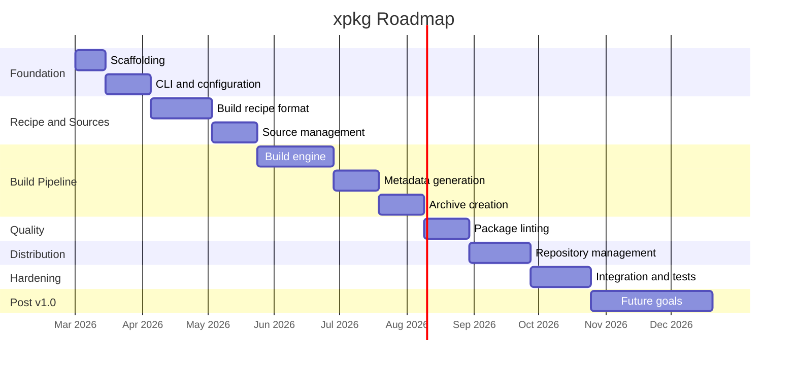

# Roadmap — xpkg Package Builder

> Rust-based package building tool for the X distribution — the developer companion to xpm.

## Current Status

Phases 0–2 complete — Cargo workspace scaffolded, CLI with 8 subcommands,
TOML configuration parser, XBUILD parser, PKGBUILD parser, recipe
validation, srcinfo generator, and `xpkg new` template generator are all
implemented and tested (26 unit tests passing). CLI and XBUILD format are
documented in `docs/`.
Next step: Phase 3 (source management — downloading, checksums, extraction).

---

## Phase 0 · Project Scaffolding <!-- phase:phase-0:scaffolding -->

- [x] Initialize Rust crate with cargo init (#1)
- [x] Configure Cargo workspace — xpkg (binary) and xpkg-core (library) (#2)
- [x] Add linter and formatter configuration — clippy.toml and rustfmt.toml (#3)
- [x] Set up CI pipeline — GitHub Actions for build, test, clippy, fmt (#4)
- [x] Add license and crate metadata — GPL-3.0-or-later, Cargo.toml fields (#5)
- [x] Create initial README with project overview (#6)

## Phase 1 · CLI and Configuration <!-- phase:phase-1:cli -->

- [x] Implement CLI interface with clap — build, lint, new, srcinfo, info, verify, repo-add, repo-remove subcommands (#7)
- [x] Implement configuration parser — ~/.config/xpkg/xpkg.conf TOML format (#8)
- [x] Implement main.rs orchestration — logging, config loading, subcommand dispatch (#9)
- [x] Implement global flags — verbose, no-confirm, no-color, builddir, outdir (#10)
- [x] Implement xpkg new subcommand — generate XBUILD template for a given package name (#11)
- [x] Define CLI reference documentation — document all commands, flags, and usage patterns (#12)

## Phase 2 · Build Recipe Format <!-- phase:phase-2:recipes -->

- [x] Define XBUILD specification — TOML-based build recipe format (#13)
- [x] Define package section — name, version, release, description, url, license, arch
- [x] Define dependencies section — depends, makedepends, checkdepends, optdepends
- [x] Define source section — urls, sha256sums, sha512sums, patches
- [x] Define build section — prepare, build, check, package functions as multiline strings
- [x] Implement XBUILD parser — deserialize TOML into Recipe struct with validation (#14)
- [x] Implement PKGBUILD parser — parse Arch Linux PKGBUILD bash scripts for compatibility (#15)
- [x] Extract variables — pkgname, pkgver, pkgrel, depends, makedepends, source, sha256sums
- [x] Extract functions — prepare(), build(), check(), package()
- [x] Implement recipe validation — check required fields, verify arch values, validate URLs (#16)
- [x] Implement srcinfo generator — produce .SRCINFO-equivalent from parsed recipe (#17)
- [x] Write recipe parser test suite — valid, invalid, edge-case XBUILD and PKGBUILD files (#18)

## Phase 3 · Source Management <!-- phase:phase-3:sources -->

- [ ] Implement source downloader — HTTP/HTTPS download with progress, retries, and resume (#19)
- [ ] Implement checksum verification — SHA-256 and SHA-512 validation of downloaded sources (#20)
- [ ] Implement source extraction — tar.gz, tar.xz, tar.bz2, tar.zst, zip archive handling (#21)
- [ ] Implement Git source support — clone, checkout specific tags, commits, or branches (#22)
- [ ] Implement source caching — avoid re-downloading unchanged sources (#23)
- [ ] Write source management test suite — download, verify, extract, and cache tests (#24)

## Phase 4 · Build Engine <!-- phase:phase-4:build-engine -->

- [ ] Implement build orchestration — prepare → build → check → package pipeline (#25)
- [ ] Implement fakeroot environment — build without real root privileges (#26)
- [ ] Implement environment variables — PKGDIR, SRCDIR, BUILDDIR, MAKEFLAGS, CFLAGS, CXXFLAGS (#27)
- [ ] Implement build script execution — run shell commands from recipe build/package sections (#28)
- [ ] Implement build logging — capture stdout/stderr with timestamps (#29)
- [ ] Implement build isolation — clean builddir per package, prevent host contamination (#30)
- [ ] Write build engine test suite — end-to-end build from recipe to installed files (#31)

## Phase 5 · Package Metadata Generation <!-- phase:phase-5:metadata -->

- [ ] Implement .PKGINFO generator — name, version, description, dependencies, provides, conflicts, size (#32)
- [ ] Implement .BUILDINFO generator — build environment, packager, builddate, installed packages (#33)
- [ ] Implement .MTREE generator — file hashes, permissions, ownership, symlinks for integrity verification (#34)
- [ ] Implement .INSTALL script support — pre_install, post_install, pre_upgrade, post_upgrade, pre_remove, post_remove (#35)
- [ ] Write metadata generation test suite — validate generated files against specification (#36)

## Phase 6 · Package Archive Creation <!-- phase:phase-6:archives -->

- [ ] Implement .xp archive builder — tar.zst creation with metadata files and package content (#37)
  - [ ] Pack .PKGINFO, .BUILDINFO, .MTREE at archive root
  - [ ] Pack file tree with correct permissions and ownership
  - [ ] Configure zstd compression level from config
- [ ] Implement package signing — OpenPGP detached signatures (.sig) via sequoia-openpgp (#38)
- [ ] Implement strip binaries — optional ELF binary stripping to reduce package size (#39)
- [ ] Write archive creation test suite — round-trip build, extract, and verify tests (#40)

## Phase 7 · Package Linting <!-- phase:phase-7:linting -->

- [ ] Implement linting framework — pluggable rule engine with severity levels (error, warning, info) (#41)
- [ ] Implement dependency checks — verify all ELF dependencies are declared in depends (#42)
- [ ] Implement permission checks — flag world-writable files, incorrect ownership, suid/sgid (#43)
- [ ] Implement path checks — detect files in non-standard directories (/usr/local, /opt misuse) (#44)
- [ ] Implement metadata checks — validate .PKGINFO completeness and field correctness (#45)
- [ ] Implement ELF analysis — check for missing RPATH, unneeded TEXTREL, stack protector (#46)
- [ ] Implement linting reports — human-readable and machine-parseable output formats (#47)
- [ ] Write linting test suite — packages with known issues for each lint rule (#48)

## Phase 8 · Repository Management <!-- phase:phase-8:repo-tools -->

- [ ] Implement repo-add subcommand — add packages to a repository database (.db.tar.zst) (#49)
  - [ ] Create desc and depends entries from package metadata
  - [ ] Update existing entries on version upgrade
  - [ ] Sign repository database if configured
- [ ] Implement repo-remove subcommand — remove packages from repository database (#50)
- [ ] Implement repo database format — compatible with ALPM repo-db format for xpm consumption (#51)
- [ ] Implement GitHub Pages deployment helper — generate static repo structure for hosting (#52)
- [ ] Write repository management test suite — add, remove, update, and verify repo databases (#53)

## Phase 9 · Integration and Hardening <!-- phase:phase-9:integration -->

- [ ] Implement xpkg verify subcommand — validate .xp package integrity and signatures (#54)
- [ ] Implement xpkg info subcommand — display metadata from a .xp archive without installing (#55)
- [ ] Integration tests with xpm — build packages with xpkg and install with xpm end-to-end (#56)
- [ ] Run comparative benchmarks vs makepkg — build time, package size, and compression performance (#57)
- [ ] Complete test suite — unit, integration, and edge-case coverage (#58)
- [ ] Audit error handling — corrupt sources, disk full, interrupted builds, missing dependencies (#59)

## Phase 10 · Future Goals — Post v1.0 <!-- phase:phase-10:future -->

- [ ] Implement split packages — multiple packages from a single XBUILD recipe (#60)
- [ ] Implement cross-compilation support — build for different architectures (#61)
- [ ] Implement clean chroot builds — isolated build environment using namespaces (#62)
- [ ] Implement batch builds — build multiple packages in dependency order (#63)
- [ ] Implement AUR-like helper integration — fetch and build from community recipes (#64)
- [ ] Implement VCS package support — automatic version detection for git/svn/hg sources (#65)
- [ ] Implement translations — multi-language support based on system locale (#66)

---

## Phase Diagram

---

> **Versioning convention:**
> - `v0.1.0` — Phases 0–1 complete (functional CLI with configuration)
> - `v0.3.0` — Phases 2–3 complete (recipe parsing and source management)
> - `v0.5.0` — Phases 4–6 complete (build engine and archive creation)
> - `v0.7.0` — Phase 7 complete (linting framework)
> - `v0.9.0` — Phases 8–9 complete (repository tooling and integration)
> - `v1.0.0` — Benchmarked, tested, production-ready
